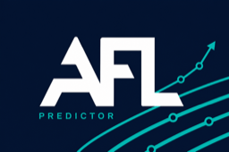
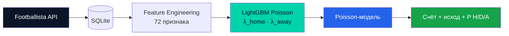

<p align="center">
  
</p>

<h1 align="center">AFL Predictor</h1>

<p align="center">
  ML-система прогнозирования матчей любительской лиги AFL<br>
  <sub>исход · счёт · вероятности — из одной согласованной Poisson-модели</sub>
</p>

<p align="center">
  
  
  
  
</p>

---

## О проекте

**AFL Predictor** загружает историю матчей с [Footballista](https://footballista.ru/app), строит признаки без утечки данных и обучает модель для прогноза:

| Прогноз | Описание |
|---------|----------|
| **Счёт** | Наиболее вероятный результат (голы хозяев : гости) |
| **Исход** | Победа хозяев / ничья / победа гостей — всегда согласован со счётом |
| **Вероятности** | P(H), P(D), P(A) из Poisson-распределения |

По умолчанию настроена лига **AFL Moscow 8×8** — любительский футбол 8 на 8.

---

## Быстрый старт

```bash
git clone https://github.com/BrasD99/afl-predictor.git
cd afl-predictor
pip install -e .

# 1. Найти ID лиги
python scripts/list_leagues.py

# 2. Указать лигу в config/config.yaml

# 3. Загрузить матчи
python scripts/fetch_matches.py

# 4. Обучить модель (с графиками для отчётов)
python scripts/train_model.py
#    или скачать готовые веса — см. раздел «Готовые веса модели»

# 5. Прогноз матча
python scripts/predict_match.py <home_id> <away_id>
```

### Google Colab

В Colab уже стоят NumPy 2, pandas, scikit-learn и LightGBM (Python 3.13). Отдельный даунгрейд NumPy не нужен и вреден: у NumPy 1.x нет колёс под Python 3.13, pip собирает его из исходников десятки минут и после этого ломает предустановленные пакеты.

```python
!git clone https://github.com/BrasD99/afl-predictor.git
%cd afl-predictor
!pip install -r requirements.txt
```

Перезапуск runtime не нужен. Дальше — распаковка `models.zip` в `data/` и `python scripts/fetch_matches.py`, как в разделе «Готовые веса модели».

<details>
<summary><b>Консольные команды</b></summary>

| Команда | Алиас | Описание |
|---------|-------|----------|
| `python scripts/list_leagues.py` | `afl-list` | Список лиг Footballista |
| `python scripts/fetch_matches.py` | `afl-fetch` | Загрузка матчей в SQLite |
| `python scripts/train_model.py` | `afl-train` | Обучение + PNG-отчёты |
| `python scripts/predict_match.py` | `afl-predict` | Прогноз матча |
| `python scripts/export_teams.py` | `afl-teams` | Экспорт команд в CSV |

</details>

---

## Готовые веса модели

Можно не обучать модель с нуля — скачайте [models.zip](https://drive.google.com/file/d/1uH-zx1P4a8U2RUYZ3FLT5oAumTnsZt4_/view?usp=sharing) (внутри папка `models/` с весами).

Архив содержит обученную Poisson-модель для **AFL Moscow 8×8** (лига `394`):

| Файл | Назначение |
|------|------------|
| `home_score_model.joblib` | Регрессор λ голов хозяев |
| `away_score_model.joblib` | Регрессор λ голов гостей |
| `feature_columns.joblib` | Список из 72 признаков |
| `model_meta.joblib` | Метаданные (лига, тип модели) |
| `model_env.json` | Версии Python / numpy / sklearn при обучении |

### После скачивания

```bash
# 1. Установить зависимости
pip install -e .

# 2. Распаковать архив в data/ (внутри архива — папка models/)
mkdir -p data
unzip ~/Downloads/models.zip -d data/
#    → data/models/home_score_model.joblib
#    → data/models/away_score_model.joblib
#    → ... (остальные файлы из таблицы выше)

# 3. Загрузить историю матчей в БД (нужна для расчёта признаков при прогнозе)
python scripts/fetch_matches.py

# 4. Прогноз
python scripts/predict_match.py <home_id> <away_id>
```

> **Важно:** веса — это только ML-модель. Для прогноза всё равно нужна **база матчей** (`data/afl_predictor.db`): по ней считаются форма, Elo, H2H и остальные признаки на момент матча. Без `fetch_matches` предсказать не получится.

Путь к весам задаётся в `config/config.yaml` → `training.models_dir` (по умолчанию `data/models`).

Веса рассчитаны на NumPy 2 (то, что уже стоит в Colab). Если загрузка падает с ошибкой совместимости — поставьте зависимости из `requirements.txt` и перезапустите сессию, либо переобучите: `python scripts/train_model.py`. Не ставьте `numpy<2`: на Python 3.13 это сборка из исходников.

---

## Пример прогноза

```
Лига: AFL Moscow 8x8 (id=394)
Матч: Команда А (id=123) vs Команда Б (id=456)

Прогноз счёта: 2 : 1 (ожидание: 2.1 : 0.9)
Прогноз исхода:  победа хозяев (H)

Вероятности:
  хозяева: 58.2%
  ничья:   22.1%
  гости:   19.7%
```

---

## Как это работает



### Как строится обучающая выборка

Матчи обрабатываются **строго по дате** (`played_at`). Для каждого матча:

```
прошлые матчи → признаки (X) → записать в датасет вместе с фактом (y) → добавить матч в историю
```

| | Что используется |
|---|------------------|
| **Признаки (X)** | Только история **до** этого матча — форма, Elo, H2H, отдых |
| **Цель (y)** | Фактический счёт и исход **этого** матча |
| **Порядок** | Сначала считаем X, потом добавляем результат матча в историю для следующих |

Текущий матч **никогда не входит** в свои признаки — это защита от утечки данных (data leakage).

**Какая история учитывается:**

| Признак | Откуда берётся прошлое |
|---------|------------------------|
| Сезон, форма, H2H, дом/выезд | Только **текущий сезон**, матчи до этого |
| Elo | **Вся лига** по всем сезонам, хронологически до этого матча |
| Отдых | Дни с последнего матча команды |

**Разбиение на train / test** тоже временное: последние 20% матчей по дате — тест. Модель не обучается на будущем.

При прогнозе (`predict_match`) логика та же: признаки строятся так, как если бы матч ещё не сыгран.

### Модель

Единая **Poisson-модель счёта** — без отдельного классификатора:

```
Признаки → LightGBM(objective=poisson) → λ_home, λ_away → Poisson → счёт + исход + вероятности
```

- **LightGBM** с `objective=poisson` — правильная функция потерь для счётных голов
- **Poisson** поверх λ — согласованный счёт и исход (не бывает ничьей при 2:1)
- **Optuna** — подбор гиперпараметров (опционально)
- **Temporal split** — последние 20% матчей по дате = тест

### Признаки (72)

72 числовых признака на матч. См. раздел выше — все они считаются **до начала матча**.

<details>
<summary><b>Полный список групп признаков</b></summary>

| Группа | Примеры |
|--------|---------|
| Сезон | очки, PPG, разница голов |
| Атака / оборона | голы за и пропущенные за матч |
| Дом / выезд | PPG дома, PPG в гостях |
| Форма | последние N матчей, форма на своём поле |
| Elo | рейтинг, adj diff, win prob |
| Opp-adjusted форма | очки × сила соперника |
| Отдых | дни с прошлого матча, short rest |
| H2H | очки, средний тотал, win rate |
| Диффы | season_ppg_diff, attack_strength_diff |
| Poisson | exp_home_goals, exp_total_goals |
| Серии | unbeaten_streak |

</details>

---

## Отчёты при обучении

После `train_model.py` в `data/reports/<timestamp>/` создаются PNG для презентаций:

| Файл | Содержание |
|------|------------|
| `01_metrics_summary` | Точность исхода, MAE по λ |
| `02_confusion_matrix` | Матрица ошибок H/D/A |
| `03–04_feature_importance_*` | Топ-20 признаков |
| `05–06_score_scatter_*` | Факт vs λ |
| `07_score_residuals` | Распределение ошибок |
| `08_outcome_calibration` | Калибровка вероятностей |

```bash
python scripts/train_model.py --no-plots   # без графиков
```

---

## Конфигурация

`config/config.yaml`:

| Параметр | По умолчанию | Описание |
|----------|--------------|----------|
| `league.id` | `394` | ID лиги на Footballista |
| `training.form_window` | `5` | Окно скользящей формы |
| `training.h2h_window` | `5` | Окно личных встреч |
| `training.test_fraction` | `0.2` | Доля теста (по дате) |
| `training.optuna_trials` | `30` | Подбор гиперпараметров (`0` = выкл.) |
| `training.reports_dir` | `data/reports` | Каталог PNG-отчётов |
| `training.generate_plots` | `true` | Генерировать графики |

---

## Структура проекта

```
afl-predictor/
├── docs/logo.png              # Логотип проекта
├── config/config.yaml         # Конфигурация
├── scripts/                   # CLI-обёртки
└── src/afl_predictor/
    ├── api/                   # Footballista GraphQL
    ├── db/                    # SQLite + SQLAlchemy
    ├── features/              # Инженерия признаков
    └── ml/                    # Обучение, Poisson, прогноз
```

---

## Ограничения

- Одна лига на конфиг — модель привязана к `league.id`
- Загрузка **insert-only** — уже сохранённые матчи не обновляются
- Нужен NumPy 2 (`numpy>=2` в `requirements.txt`)

---

## Стек

<p align="center">
  
  
  
  
  
  
  
  
  
  
</p>

---

<p align="center">
  <sub>Сделано для любительской лиги AFL · данные <a href="https://footballista.ru/app">Footballista</a></sub>
</p>
